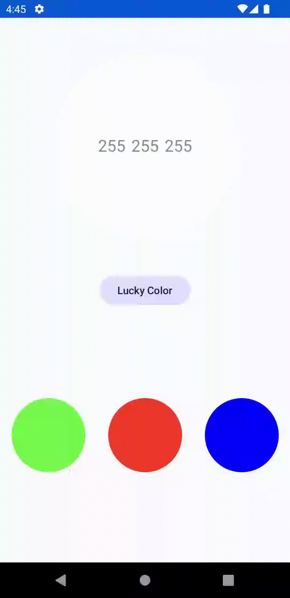

# Linear Color Definer

Inspired by [Linear Colour Definer - Motion Design](https://dribbble.com/shots/19479207-Linear-Colour-Definer-Motion-Design).

## Technical Features

- Programming Language | [Kotlin](https://kotlinlang.org/) 
- User Interface | [Jetpack Compose](https://developer.android.com/jetpack/compose)
  - [Material 3](https://m3.material.io/)
  - [ClipboardManager](https://developer.android.com/reference/kotlin/androidx/compose/ui/platform/ClipboardManager)
  - [PointerInputScope.detectDragGestures()](https://developer.android.com/reference/kotlin/androidx/compose/foundation/gestures/package-summary#(androidx.compose.ui.input.pointer.PointerInputScope).detectDragGestures(kotlin.Function1,kotlin.Function0,kotlin.Function0,kotlin.Function2))
